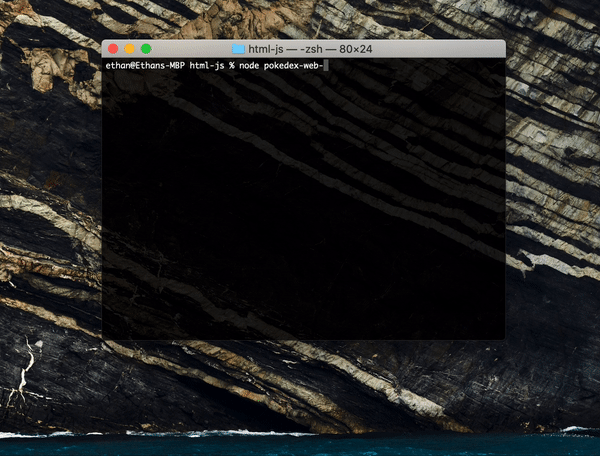

# Pokedex Web Scraper 📟

The Pokedex Web Scraper is a simple terminal program that can pull up the information of any pokemon by utilizing node.js. The primary packages that are used in this script are ```Puppeteer``` and ```Terminal Images```.



Also, if the Pokemon's name is mispelled the program may not successfully display the Pokemon's information.

